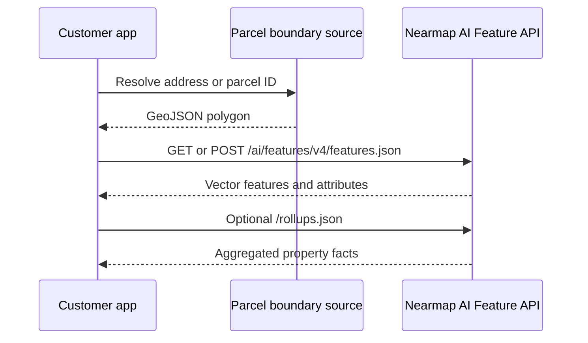

# Use the AI Feature API

AI Feature API calls start with an AOI. That AOI can come from a parcel boundary, a geocoded address workflow, or a user-drawn polygon.



## Request pattern



```bash
curl "https://api.nearmap.com/ai/features/v4/features.json?polygon=$POLYGON&apikey=$NEARMAP_API_KEY"
```



```bash
curl "https://api.nearmap.com/ai/features/v4/rollups.json?polygon=$POLYGON&apikey=$NEARMAP_API_KEY"
```



## Handling AOI intersections

The public docs explain that feature polygons intersecting the query polygon are generally returned in full rather than truncated. Vegetation and Surfaces are the exception because potentially unbounded features are cropped to the query AOI.
