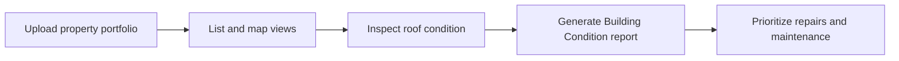

# Roof Assessment

Roof Assessment helps facilities and property teams inspect properties, assess roof condition, export portfolios, and generate Building Condition reports.

## Workflow

## Key pages to migrate later

* Roof Assessment quick start
* View site detections
* Generate a Building Condition Report
* Export a portfolio
